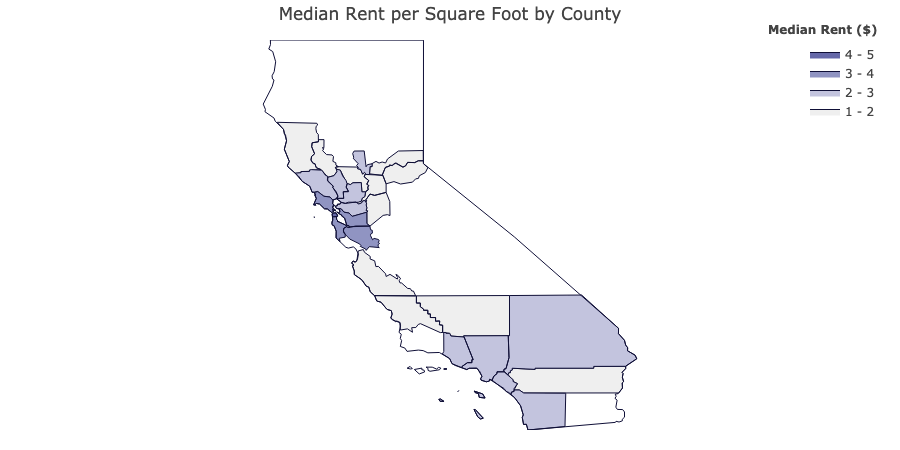

# Visualize Median rent per square in California

I have a data set on the posts about rent from Craigslist. I am interested on the median rent in every county in California. I want to visualize the median rent on the California map.
 

## Tools and preparation
In this project, I will use Python and Plotly for visualization. Luckily, Plotly has a feature to draw borders based on FIPS (Federal Information Processing Standards) defined by the US government. That means if you have the county's FIPS, Plotly could draw the border automatically.  

The jupyter notebook for EDA could be found [here](EDA.ipynb) 

## Data Cleansing and Implementation
The data set consists some posts outside of California. But since that subset accounts less than 1% of the whole data set, I excluded those posts and focus on California.  
Then, I obtain the median rent per square foot in California counties based on the data set.
 
After that, I obtained the list of county FIPS from US government's website and filter out the non-California FIPS because there are county names are duplicated across some states.
 
Next, I merge the list of FIPS and median rent per square foot based on California counties. And finally, plot it with Plotly.

## Result
You may find the visualization below.

#### Reference
<a href="https://medium.com/@plotlygraphs/what-is-a-fips-code-county-level-charts-in-python-4eff383a4cf6">https://medium.com/@plotlygraphs/what-is-a-fips-code-county-level-charts-in-python-4eff383a4cf6</a> 
<a href="https://plot.ly/~Dreamshot/9218/import-plotly-plotly-version-/#/">https://plot.ly/~Dreamshot/9218/import-plotly-plotly-version-/#/</a>